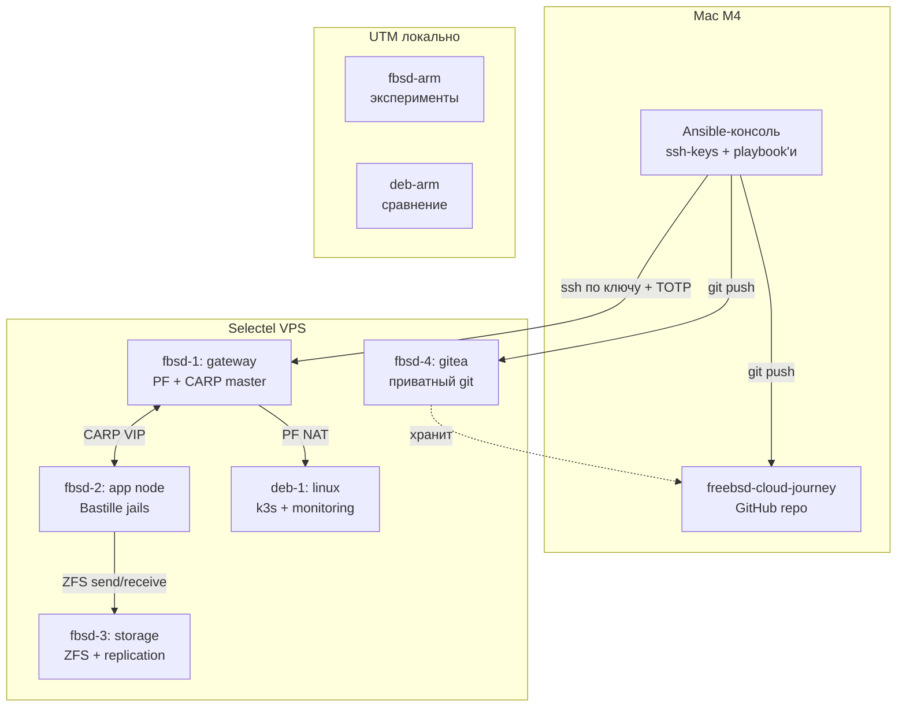

```mermaid
graph TB
    subgraph Laptop[Mac M4]
        Console[Ansible-консоль<br/>ssh-keys + playbook'и]
        RepoGitHub[freebsd-cloud-journey<br/>GitHub repo]
    end

    subgraph Selectel[Selectel VPS]
        F1[fbsd-1: gateway<br/>PF + CARP master]
        F2[fbsd-2: app node<br/>Bastille jails]
        F3[fbsd-3: storage<br/>ZFS + replication]
        L1[deb-1: linux<br/>k3s + monitoring]
        Gitea[fbsd-4: gitea<br/>приватный git]
    end

    subgraph LocalLab[UTM локально]
        FARM[fbsd-arm<br/>эксперименты]
        DARM[deb-arm<br/>сравнение]
    end

    Console -->|ssh по ключу + TOTP| F1
    Console -->|git push| Gitea
    Console -->|git push| RepoGitHub
    F1 <-->|CARP VIP| F2
    F2 -->|ZFS send/receive| F3
    F1 -->|PF NAT| L1
    Gitea -.хранит.-> RepoGitHub
```
