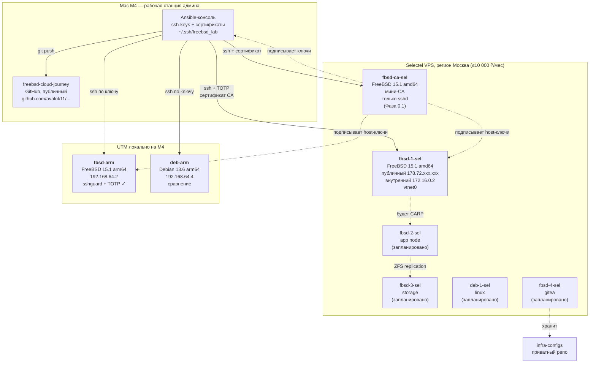

# Архитектура FreeBSD Private Cloud

Целевая архитектура продуктового кластера. Диаграмма в формате Mermaid — GitHub рисует её автоматически.

## Текущая фактическая топология (после Фазы 0)

## Принципы

1. **Ноутбук — не часть кластера.** Это рабочая станция админа, через которую идёт управление.
2. **Динамический домашний IP — не проблема.** Все подключения инициируются от ноутбука к Selectel, обратного трафика нет.
3. **Два репозитория:**
   - `freebsd-cloud-journey` (GitHub, публичный) — кейс, отчёты, схемы, портфолио.
   - `infra-configs` (Gitea, приватный) — Ansible, конфиги, secrets. **Никаких реальных IP, доменов, сертификатов в публичном репо.**
4. **Локально — для экспериментов.** На M4 в UTM поднимаем FreeBSD arm64 для отладки, можно ломать без боли.
5. **Удалённо — production-like.** В Selectel FreeBSD amd64, как у реального заказчика.

## Что развёрнуто на 2026-08-11

### Selectel

| Нода | Хостнейм | ОС | Внешний IP | Внутренний IP | Назначение | Статус |
|---|---|---|---|---|---|---|
| **fbsd-1-sel** | `fbsd-1-sel.lab.sel` | FreeBSD 15.1-RELEASE amd64 | `178.72.xxx.xxx` (замазан) | `172.16.0.2/16` (vtnet0) | Шлюз, тест-нода | **активен**, sshguard + TOTP |
| **fbsd-ca-sel** | `fbsd-ca-sel.lab.sel` | FreeBSD 15.1-RELEASE amd64 | (будет в Фазе 0.1) | (будет в Фазе 0.1) | Мини-CA, только sshd | **планируется, Фаза 0.1** |

### Локальный стенд (UTM на Mac M4)

| ВМ | Хостнейм | ОС | IP | Назначение | Статус |
|---|---|---|---|---|---|
| **fbsd-arm** | `fbsd-arm` | FreeBSD 15.1 arm64 | `192.168.64.2` | Эксперименты | **активен**, sshguard + TOTP |
| **deb-arm** | `deb-arm` | Debian 13.6 arm64 | `192.168.64.4` | Сравнение с Linux | **активен**, ssh по ключу |

## Сеть

| Сеть | Назначение | CIDR |
|---|---|---|
| **Публичная** (Selectel) | Доступ из интернета, ssh, http | Выдаётся Selectel |
| **Приватная Selectel** | Связь между нодами внутри дата-центра | `172.16.0.0/16` (по умолчанию) |
| **Host-Only UTM** (локально) | Связь Mac M4 ↔ локальные ВМ | `192.168.64.0/24` |
| **CARP / внутренняя** (планируется) | Связь между FreeBSD-нодами для HA | `10.10.0.0/24` |
| **Storage** (планируется) | ZFS-репликация | `10.10.1.0/24` |
| **Bastille VNET** (планируется) | Сеть для jail-ов | `10.10.10.0/24` |

## Безопасность на fbsd-1-sel

- ✅ SSH по ключу (ed25519, `~/.ssh/freebsd_lab`).
- ✅ TOTP через Yandex Key (`pam_google_authenticator`).
- ✅ `PasswordAuthentication no`, `PermitRootLogin no`.
- ✅ AuthenticationMethods: `publickey,keyboard-interactive:pam`.
- ✅ sshguard + PF (активирован, таблица `<sshguard>`, тест блокировки пройден).
- ✅ ntpd для синхронизации времени.
- ✅ NTP-сервер time.cloudflare.com.
- ⏳ **SSH CA (Фаза 0.1):** User CA + Host CA на `fbsd-ca-sel` (отдельная нода в Selectel), подписанные ключи с TTL 8 часов, CRL для отзыва.

## Что нужно донастроить (задачи)

- [x] Активировать sshguard + PF на fbsd-1-sel (как на fbsd-arm).
- [ ] Создать `fbsd-2-sel` (для HA-тестов в Фазе 3).

## Хранилище (ZFS-пулы) — планируется

| Нода | Пул | Назначение | RAID |
|---|---|---|---|
| fbsd-1-sel | zroot | Система | stripe (для теста), mirror в проде |
| fbsd-2-sel | zroot + tank | Система + данные jail-ов | mirror |
| fbsd-3-sel | tank | Бэкапы, реплики | mirror |

## Сервисы в Bastille-jails (планируется)

| Jail | Сервис | Порт |
|---|---|---|
| nginx | Reverse proxy | 80, 443 |
| app | PHP-FPM / приложение | 9000 (internal) |
| db | PostgreSQL | 5432 (internal) |
| mail | Postfix + Dovecot | 25, 143, 587 |
| monitor | Prometheus + Grafana | 9090, 3000 |

Точные конфигурации — в Фазе 2.

## История изменений

- **2026-08-11 (v2.1)** — на fbsd-1-sel активирован sshguard + PF, статус синхронизирован с fbsd-arm.
- **2026-08-11 (v2)** — развёрнут `fbsd-1-sel` в Selectel (FreeBSD 15.1, публичный IP, ssh + TOTP), `deb-arm` в UTM (Debian 13.6). Фактические IP зафиксированы.
- **2026-08-06 (v1)** — стартовая схема, добавлены два репозитория (GitHub + Gitea), гибридный стенд.
