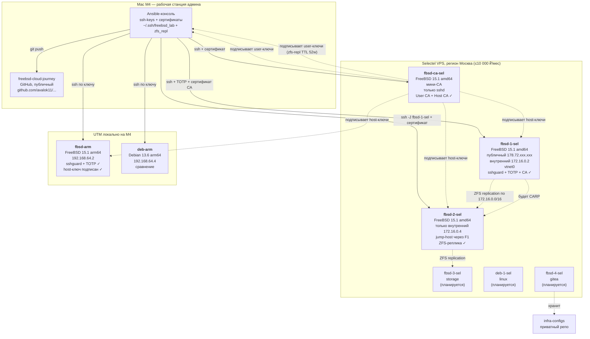

# Архитектура FreeBSD Private Cloud

Целевая архитектура продуктового кластера. Диаграмма в формате Mermaid — GitHub рисует её автоматически.

## Текущая фактическая топология (после Фазы 0.1)

## Принципы

1. **Ноутбук — не часть кластера.** Это рабочая станция админа, через которую идёт управление.
2. **Динамический домашний IP — не проблема.** Все подключения инициируются от ноутбука к Selectel, обратного трафика нет.
3. **Два репозитория:**
   - `freebsd-cloud-journey` (GitHub, публичный) — кейс, отчёты, схемы, портфолио.
   - `infra-configs` (Gitea, приватный) — Ansible, конфиги, secrets. **Никаких реальных IP, доменов, сертификатов в публичном репо.**
4. **Локально — для экспериментов.** На M4 в UTM поднимаем FreeBSD arm64 для отладки, можно ломать без боли.
5. **Удалённо — production-like.** В Selectel FreeBSD amd64, как у реального заказчика.
6. **Межсервисный трафик — по приватной сети Selectel.** Репликация ZFS, сервисный SSH `zfs-repl`, будущий CARP/heartbeat — всё через `172.16.0.0/16`, не через интернет. Дешевле, быстрее, меньше поверхность атаки.

## Что развёрнуто на 2026-08-30

### Selectel

| Нода | Хостнейм | ОС | Внешний IP | Внутренний IP | Назначение | Статус |
|---|---|---|---|---|---|---|
| **fbsd-1-sel** | `fbsd-1-sel.lab.sel` | FreeBSD 15.1-RELEASE amd64 | `178.72.xxx.xxx` (замазан) | `172.16.0.2/16` (vtnet0) | Шлюз, тест-нода, jump-host | **активен**, sshguard + TOTP + CA-доверие |
| **fbsd-ca-sel** | `fbsd-ca-sel.lab.sel` | FreeBSD 15.1-RELEASE amd64 | (jump через F1) | `172.16.0.3/16` (vtnet0) | Мини-CA, только sshd | **активен**, User CA + Host CA, CRL |
| **fbsd-2-sel** | `fbsd-2-sel.lab.sel` | FreeBSD 15.1-RELEASE amd64 | **нет** (только приватный) | `172.16.0.4/16` (vtnet0) | ZFS-реплика, будущая CARP-пара | **активен**, sshguard + TOTP + CA-доверие, вход через `ssh -J fbsd-1-sel` |

### Локальный стенд (UTM на Mac M4)

| ВМ | Хостнейм | ОС | IP | Назначение | Статус |
|---|---|---|---|---|---|
| **fbsd-arm** | `fbsd-arm` | FreeBSD 15.1 arm64 | `192.168.64.2` | Эксперименты | **активен**, sshguard + TOTP, host-ключ подписан |
| **deb-arm** | `deb-arm` | Debian 13.6 arm64 | `192.168.64.4` | Сравнение с Linux | **активен**, ssh по ключу |

## Сеть

| Сеть | Назначение | CIDR |
|---|---|---|
| **Публичная** (Selectel) | Доступ из интернета, ssh, http | Выдаётся Selectel |
| **Приватная Selectel** | Связь между нодами внутри дата-центра | `172.16.0.0/16` (по умолчанию) |
| **Host-Only UTM** (локально) | Связь Mac M4 ↔ локальные ВМ | `192.168.64.0/24` |
| **CARP / внутренняя** (планируется) | Связь между FreeBSD-нодами для HA | `10.10.0.0/24` |
| **Storage** (планируется) | ZFS-репликация | `10.10.1.0/24` |
| **Bastille VNET** (планируется) | Сеть для jail-ов | `10.10.10.0/24` |

## Безопасность на FreeBSD-нодах (fbsd-1-sel, fbsd-ca-sel, fbsd-arm)

- ✅ SSH по ключу (ed25519, `~/.ssh/freebsd_lab` на Mac M4).
- ✅ TOTP через Yandex Key (`pam_google_authenticator`).
- ✅ `PasswordAuthentication no`, `PermitRootLogin no`.
- ✅ AuthenticationMethods: `publickey,keyboard-interactive:pam`.
- ✅ sshguard + PF (активирован, таблица `<sshguard>`, тест блокировки пройден).
- ✅ ntpd для синхронизации времени.
- ✅ NTP-сервер time.cloudflare.com.
- ✅ **SSH CA (Фаза 0.1 закрыта):** User CA + Host CA на `fbsd-ca-sel`. Host-ключи `fbsd-1-sel`, `fbsd-2-sel`, `fbsd-arm` подписаны (TTL 52w). Пользовательский ключ `freebsd_lab` подписан (TTL 8h, переподпись). CRL настроен вручную, проверен. **Автоматизация CRL — Фаза 4** (Ansible).

## Безопасность на `fbsd-2-sel` (jump-only, без TOTP)

- ✅ SSH по сертификату (User CA + Host CA, вход под `avalok11` по `freebsd_lab-cert.pub`).
- ✅ `PasswordAuthentication no`, `PermitRootLogin no`.
- ✅ AuthenticationMethods: `publickey` (без `keyboard-interactive`).
- ✅ sshguard + PF.
- ✅ ntpd синхронизирован.
- ✅ `user_ca.pub` скопирован на `fbsd-2-sel`, `TrustedUserCAKeys` в `sshd_config`, sshd рестартован — вход по user-сертификату работает.
- ✅ Баннер доделан (через `/etc/motd` и `Banner /etc/issue.net` в `sshd_config`).

**Почему без TOTP:** `fbsd-2-sel` не имеет публичного IP, зайти можно только через `fbsd-1-sel` (jump-host), на котором TOTP уже стоит. Двойной TOTP на цепочке — избыточен и замедляет работу. Единственная защита ноды — пара ed25519-ключ + сертификат CA с TTL 8h, что сознательно принято как tradeoff (см. «Ключевые решения» в `docs/phase-1/README.md`).

## Хранилище (ZFS-пулы) — в работе

| Нода | Пул | Назначение | RAID |
|---|---|---|---|
| fbsd-1-sel | zroot + tank | Система + данные для реплики | stripe на Selectel (1 диск); mirror в проде |
| fbsd-2-sel | zroot + tank | Система + приёмник реплики (`tank/repl`) | stripe на Selectel |
| fbsd-3-sel | tank | Бэкапы, offsite-реплики | mirror (планируется) |

## Сервисы в Bastille-jails (планируется)

| Jail | Сервис | Порт |
|---|---|---|
| nginx | Reverse proxy | 80, 443 |
| app | PHP-FPM / приложение | 9000 (internal) |
| db | PostgreSQL | 5432 (internal) |
| mail | Postfix + Dovecot | 25, 143, 587 |
| monitor | Prometheus + Grafana | 9090, 3000 |

Точные конфигурации — в Фазе 2.

## История изменений

- **2026-09-06 (v3.2, Неделя 1 Фазы 1 закрыта)** — `fbsd-2-sel` приведён к финальному виду: TOTP снят, `user_ca.pub` скопирован, `TrustedUserCAKeys` в `sshd_config` + рестарт, баннер в `/etc/motd` + `Banner` в `sshd_config`. Все пункты «Что нужно донастроить» закрыты, раздел удалён. Сеть унифицирована с `fbsd-1-sel` (search domain `lab.sel`, CIDR-нотация, полный DNS-список). PF v2 (antispoof, NAT-stub) применён на обеих нодах через единый `docs/phase-1/pf-ruleset.conf`. Неделя 1 (Сеть + PF) — полностью закрыта.
- **2026-09-06 (v3.1, День 1 Фазы 1, продолжение)** — на `fbsd-2-sel` снят TOTP (jump-only, single factor: ed25519 + сертификат). `user_ca.pub` скопирован на ноду, `TrustedUserCAKeys` — в работе. Причина: `fbsd-2-sel` без публичного IP, единственный путь входа — через `fbsd-1-sel` (где TOTP уже стоит), двойной TOTP на цепочке избыточен.
- **2026-08-30 (v3, День 1 Фазы 1)** — поднят `fbsd-2-sel` в Selectel (FreeBSD 15.1 amd64, только приватный IP `172.16.0.4`, jump-host через `fbsd-1-sel`). Базовый харденинг + sshguard + TOTP + ntpd выполнены. Host-ключ подписан через `fbsd-ca-sel` (TTL 52w). Баннер и User CA-доверие (`TrustedUserCAKeys`) — в работе. Решение: `fbsd-2-sel` остаётся без публичного IP, межсервисный трафик идёт по `172.16.0.0/16`.
- **2026-08-28 (v2.3, Фаза 0.1 закрыта)** — User CA + Host CA на `fbsd-ca-sel`, подписаны host-ключи `fbsd-1-sel` и `fbsd-arm`, CRL настроен, TTL-тест пройден.
- **2026-08-11 (v2.1)** — на fbsd-1-sel активирован sshguard + PF, статус синхронизирован с fbsd-arm.
- **2026-08-11 (v2)** — развёрнут `fbsd-1-sel` в Selectel (FreeBSD 15.1, публичный IP, ssh + TOTP), `deb-arm` в UTM (Debian 13.6). Фактические IP зафиксированы.
- **2026-08-06 (v1)** — стартовая схема, добавлены два репозитория (GitHub + Gitea), гибридный стенд.
