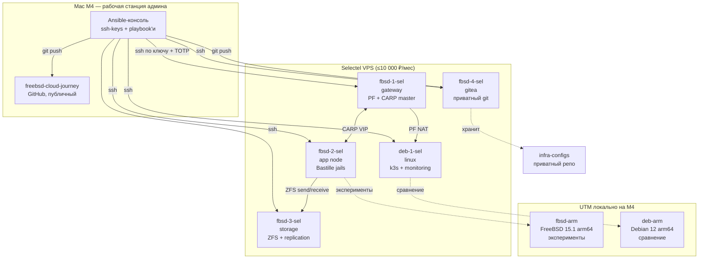

# Архитектура FreeBSD Private Cloud

Целевая архитектура продуктового кластера. Диаграмма в формате Mermaid — GitHub рисует её автоматически.

## Целевая топология (v1, по состоянию на Фазу 0)

## Принципы

1. **Ноутбук — не часть кластера.** Это рабочая станция админа, через которую идёт управление.
2. **Динамический домашний IP — не проблема.** Все подключения инициируются от ноутбука к Selectel, обратного трафика нет.
3. **Два репозитория:**
   - `freebsd-cloud-journey` (GitHub, публичный) — кейс, отчёты, схемы, портфолио.
   - `infra-configs` (Gitea, приватный) — Ansible, конфиги, secrets. **Никаких реальных IP, доменов, сертификатов в публичном репо.**
4. **Локально — для экспериментов.** На M4 в UTM поднимаем FreeBSD arm64 для отладки, можно ломать без боли.
5. **Удалённо — production-like.** В Selectel FreeBSD amd64, как у реального заказчика.

## Сеть (что планируется)

| Сеть | Назначение | CIDR (пример) |
|---|---|---|
| Публичная | Доступ из интернета, ssh, http | Выдаётся Selectel |
| Приватная (CARP) | Связь между FreeBSD-нодами | 10.10.0.0/24 |
| Storage | ZFS-репликация | 10.10.1.0/24 |
| Bastille VNET | Сеть для jail-ов | 10.10.10.0/24 |

Конкретные адреса выбираем в Фазе 3.

## Хранилище (ZFS-пулы)

| Нода | Пул | Назначение | RAID |
|---|---|---|---|
| fbsd-1-sel | zroot | Система | stripe (для теста), mirror в проде |
| fbsd-2-sel | zroot + tank | Система + данные jail-ов | mirror |
| fbsd-3-sel | tank | Бэкапы, реплики | mirror |

## Сервисы в Bastille-jails

| Jail | Сервис | Порт |
|---|---|---|
| nginx | Reverse proxy | 80, 443 |
| app | PHP-FPM / приложение | 9000 (internal) |
| db | PostgreSQL | 5432 (internal) |
| mail | Postfix + Dovecot | 25, 143, 587 |
| monitor | Prometheus + Grafana | 9090, 3000 |

Точные конфигурации — в Фазе 2.

## История изменений

- **2026-08-06 (v1)** — стартовая схема, добавлены два репозитория (GitHub + Gitea), гибридный стенд.
- ...будут уточнения по мере прохождения фаз.
