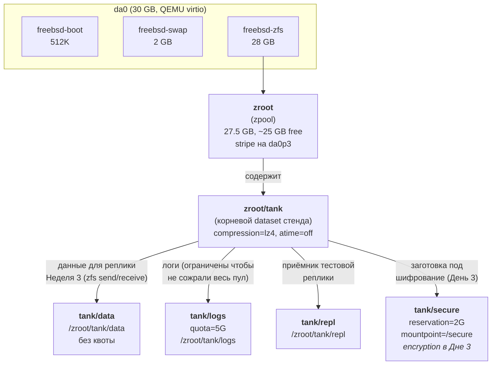

# Phase 1 — ZFS Report

Отчёт по работе с ZFS на FreeBSD 15.1 в Фазе 1. Заполняется по дням Недели 2 и Недели 3.

---

## Структура zpool (День 1, 2026-09-13)

**Нода:** fbsd-1-sel (Selectel, FreeBSD 15.1 amd64, 1 vCPU, 1 ГБ RAM, 30 ГБ SSD)
**Пул:** `zroot` (создан при установке FreeBSD), 28 ГБ под `freebsd-zfs`
**Реальное размещение:** `tank` — это **дочерний dataset `zroot/tank`**, а не отдельный zpool

### Почему так, а не отдельный пул

На Selectel VPS выделен один диск `da0` (30 ГБ), уже полностью размечен под систему:
- 512K `freebsd-boot`
- 2G `freebsd-swap`
- 28G `freebsd-zfs` → здесь живёт `zroot`

Свободного места для **отдельного** `zpool create tank /dev/da0p4` нет — четвёртого раздела на диске просто не существует. Поэтому `tank` сделан как **dataset внутри `zroot`**. Это типичное решение для учебного/тестового стенда на 1 диске; в проде (Фаза 3, нормальное железо или VPS с двумя дисками) переделаем на отдельный пул с mirror — `zfs rename -p zroot/tank tank/data` переносит данные без потерь.

### Схема иерархии



### Таблица датасетов

| Датасет | Назначение | quota | reservation | mountpoint | Создаётся в |
|---|---|---|---|---|---|
| `zroot/tank` | корневой dataset стенда | — | — | `/zroot/tank` | День 1 |
| `zroot/tank/data` | данные для реплики (Неделя 3: `zfs send/receive`) | — | — | `/zroot/tank/data` | День 1 |
| `zroot/tank/logs` | логи (защита от переполнения) | **5G** | — | `/zroot/tank/logs` | День 1 |
| `zroot/tank/repl` | приёмник тестовой реплики | — | — | `/zroot/tank/repl` | День 1 |
| `zroot/tank/secure` | заготовка под шифрование | — | **2G** | `/secure` | День 1 (encryption в День 3) |
| `zroot/tank/jails` | rootfs для Bastille-jail'ов (Фаза 2) | — | — | `/zroot/tank/jails` | Фаза 2 |

### Параметры пула и корневого dataset

| Параметр | Значение | Зачем |
|---|---|---|
| ashift | 12 (дефолт) | выравнивание записи на 4K-сектора |
| compression | lz4 (на корне tank и всех детях) | экономия 20–30% на текстовых данных (логи, конфиги), почти без нагрузки на CPU |
| atime | off | не обновлять access-time при чтении, ускоряет I/O на hot-данных |
| recordsize | 128K (дефолт) | стандарт для mixed-workload |

### Вывод `zfs list` после создания

```
NAME                QUOTA  RESERV  COMPRESS  ATIME  MOUNTPOINT
zroot/tank           none    none  lz4       off    /zroot/tank
zroot/tank/data      none    none  lz4       off    /zroot/tank/data
zroot/tank/logs        5G    none  lz4       off    /zroot/tank/logs
zroot/tank/repl      none    none  lz4       off    /zroot/tank/repl
zroot/tank/secure    none      2G  lz4       off    /secure
```

### Вывод `zpool status zroot`

```
  pool: zroot
 state: ONLINE
config:
        NAME        STATE     READ WRITE CKSUM
        zroot       ONLINE       0     0     0
          da0p3     ONLINE       0     0     0

errors: No known data errors
```

### Smoke-тест: запись и чтение

```
echo "test data" | sudo tee /zroot/tank/data/hello.txt
cat /zroot/tank/data/hello.txt
sudo rm /zroot/tank/data/hello.txt
```

Результат: файл создался, прочитался, удалился — I/O работает, dataset смонтирован в правильный путь, права `avalok11:avalok11` (через sudo).

### Решения

- **2026-09-13 — `tank` сделан как dataset на `zroot`, а не отдельный zpool.** На Selectel VPS 1 диск, всё место под `zroot`. В проде (Фаза 3, при наличии 2+ дисков или нормальном железе) переделать на `zpool create tank mirror da0 da1` (или аналог), данные мигрируют через `zfs rename -p zroot/tank tank/data`. Преимущество текущего решения: не надо переразмечать диск, иерархия датасетов сразу видна. Недостаток: scrub делается на `zroot`, а не отдельно на `tank`; для учебного стенда это несущественно.
- **2026-09-13 — `compression=lz4` на всех датасетах tank.** Для текстовых данных (логи, конфиги, исходники) даёт ~25% экономии при минимальной нагрузке на CPU. Для бинарных (дампы, архивы) — почти ноль выигрыша, но и без вреда. В Фазе 7 (нагрузочное тестирование) посмотрим, не мешает ли на реальной нагрузке.
- **2026-09-13 — `atime=off` на `tank`.** Не критично, но избавляет от лишних write-операций при каждом чтении файла. На mail/spool-серверах с большим числом мелких файлов это заметная разница, у нас пока не критично.
- **2026-09-13 — `reservation=2G` на `tank/secure`.** Гарантирует что под будущий шифрованный dataset (День 3) будет место, даже если другие датасеты его «сожрут». Без reservation `zfs list` показал бы «свободно» сколько угодно, но при попытке записи в encryption-enabled dataset можно получить `ENOSPC`.

---

## Snapshot / Rollback / Clone
*(заполним в День 2)*

## Encryption с keyfile
*(заполним в День 3)*

## Репликация `fbsd-1-sel → fbsd-2-sel`
*(заполним в Неделе 3)*

## Failover
*(заполним в Неделе 3)*
