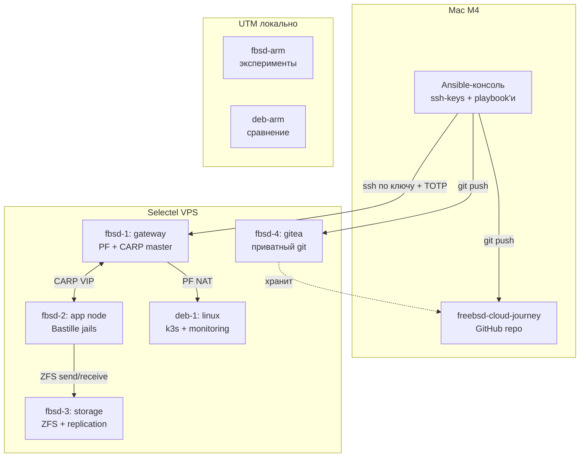

# Roadmap: FreeBSD-based Private Cloud для среднего бизнеса

**Автор плана:** Алексей (ИТ-директор, 15 лет управления)
**Дата:** 2026-08-22 (v7 — добавлена Фаза 0.1 SSH CA)
**Горизонт:** 4–6 месяцев, ~10 ч/неделю
**Бюджет на инфру:** ≤10 000 ₽/мес в Selectel
**Финальный результат:** production-ready кластер FreeBSD с горизонтальным масштабированием, резервированием и восстановлением, плюс сравнительная теоретическая база с Linux-миром.

---

## Окружения и стенды

### Два репозитория — разные роли

| Репозиторий | Где | Что внутри | Аудитория |
|---|---|---|---|
| **`freebsd-cloud-journey`** | GitHub, публичный | Описание проекта, кейс для LinkedIn, roadmap.md, отчёты по фазам, выводы, графики, схемы в Mermaid | Ты, заказчики, сообщество, потенциальные клиенты |
| **`infra-configs`** | Gitea в нашем кластере, приватный | Ansible-роли, Bastillefiles, PF-конфиги, HAProxy-конфиги, Docker Compose, prometheus.yml, всё что автоматизирует инфру | Только ты и заказчик (если он получит доступ) |

**Почему раздельно:**
- Публичное портфолио на GitHub — для маркетинга и кейса.
- Приватные конфиги в Gitea — для безопасности и приватности заказчика. **Никаких реальных IP, доменов, сертификатов в публичном репо.**
- Синхронизация между ними: можно из infra-configs (Gitea) зеркалировать обезличенные примеры в freebsd-cloud-journey (GitHub), но это уже по желанию.

**GitLab не используем.** Gitea (или Forgejo) — Go-приложение, занимает ~100 МБ RAM, ставится в jail за 5 минут, не пожирает ресурсы. GitLab требует 4–8 ГБ RAM и серьёзного обслуживания — для нашего масштаба оверкилл. Если в будущем заказчик захочет GitLab — поднимем, но в обучении идём с Gitea.

### Локальный стенд (на рабочей станции Mac M4)

**Инструмент виртуализации:** UTM (бесплатно) или VMware Fusion (бесплатно для личного использования). **VirtualBox на M4 не подходит** — он не запускает нативные ARM-гости, а x86 через эмуляцию работает нестабильно.

**Что разворачиваем локально:**

| ВМ | Архитектура | Зачем |
|---|---|---|
| `fbsd-arm` | FreeBSD 15.1 arm64 | Эксперименты с jails, PF, ZFS, Bastille. То, что можно ломать |
| `deb-arm` | Debian 12 arm64 | Сравнение с Linux, nftables, отладка |
| `bastille-dev` | FreeBSD 15.1 arm64 | Отдельная ВМ для разработки Bastille-шаблонов |

**Важно про архитектуру:** локально FreeBSD будет **arm64** (нативно для M4). В Selectel — **amd64** (x86). Большинство настроек идентичны, но есть нюансы:
- bhyve на arm64 не работает — виртуализацию через bhyve практикуем только в Selectel.
- Некоторые порты имеют только x86-сборку — при локальных экспериментах смотрим внимательно.
- Имена пакетов иногда отличаются — pkg решает автоматически, но ручная сборка из портов может потребовать корректировок.

### Удалённый стенд (Selectel, VPS)

**Вход:** готовые образы FreeBSD из панели Selectel. ISO, скачанный с сайта FreeBSD, на Selectel не используем.

**Что разворачиваем (наращиваем по фазам):**

| Фаза | VPS в Selectel | Стоимость ~ |
|---|---|---|
| 0–1 | 2× FreeBSD 14.3 (2 CPU, 4 ГБ, 30 ГБ) | 2000–3000 ₽/мес |
| 2–4 | 3× FreeBSD 14.3 + 1× Debian 12 (2 CPU, 2–4 ГБ) | 4000–6000 ₽/мес |
| 5–8 | 3× FreeBSD + 1× Linux + 1× monitoring + 1× Gitea | 7000–9000 ₽/мес |

**Оптимизация:** линейка с почасовой оплатой → останавливать на ночь и в выходные, экономия до 60–70%.

**Gitea** поднимаем в Фазе 4, как только появится Ansible-инфра. Gitea занимает ~100 МБ RAM, ставится в Bastille-jail за 5 минут.

### Ноутбук как рабочая станция

Mac M4 — **управляющая консоль**, не часть кластера. На нём:
- Установлен Ansible.
- Хранятся SSH-ключи.
- Терминал для подключения к Selectel-стенду.
- Документация, схемы, runbook'и.
- Локальная копия репозитория `freebsd-cloud-journey` (GitHub) — рабочий процесс.
- Доступ к Gitea (Selectel) через браузер и `git push`.

**Динамический домашний IP не проблема:**
- Подключение к Selectel-серверам идёт по SSH на их публичный IP — IP рабочей станции не важен.
- Из Selectel на домашний IP никто не ходит.
- Если захочешь постоянного доступа из дома — WireGuard с ноутбука как клиент, но это лишнее на этапе обучения.

---

## Сквозной принцип

Каждая фаза заканчивается **артефактом**, который можно потрогать, показать, зафиксировать в портфолио. Теория идёт **короткими брифами перед практикой** (формат: что это, зачем, как устроено, как сравнивается с Linux-аналогом, плюсы/минусы, что выбираем и почему). Без фанатизма — только то, что нужно для принятия решения.

## Сквозной чек-лист результата (что должно работать в конце)

- [ ] Минимум 3 VPS FreeBSD 14 в Selectel
- [ ] Минимум 2 ноды под нагрузкой (балансировщик + 2 application-ноды)
- [ ] ZFS-хранилище с репликацией на резервную площадку
- [ ] CARP + lagg для отказоустойчивости на сетевом уровне
- [ ] HAProxy/PF балансировка с автоматическим failover
- [ ] Сервисы в Bastille-jails (nginx, postgresql, postfix, php-fpm)
- [ ] Ansible разворачивает всю инфру за ≤2 часа с нуля
- [ ] **SSH-инфраструктура:** ключи пользователей, сервисные ключи с `forced-command`, мини-CA для ssh-сертификатов
- [ ] Prometheus + Grafana + Alertmanager, дашборды и алерты
- [ ] Нагрузочный тест (wrk/hey/vegeta), отчёт с метриками
- [ ] Backup (ZFS snapshot + Restic/Borg) по сервисному ssh-ключу, восстановление из копии на чистую ноду за ≤1 час
- [ ] Disaster Recovery план + минимум 1 успешный DR-drill
- [ ] Документация: архитектура, runbook, SLA, ценообразование

---

## Сквозная SSH-инфраструктура

Безопасный доступ по SSH — это слой, который пронизывает весь кластер.

### Принципы

1. **Пароли отключены везде.** Только ключи или сертификаты. `PasswordAuthentication no` в `/etc/ssh/sshd_config` на всех нодах.
2. **root по SSH запрещён.** Работаем через sudo из-под обычного пользователя.
3. **Минимум 3 типа ssh-доступа:**
   - **Административный** — для тебя и заказчика, через пользователя с sudo.
   - **Сервисный** — для ZFS-репликации, Ansible, бэкапов. Отдельный пользователь на каждой ноде, `nologin` шелл, `forced-command` в `authorized_keys`, ограничение по IP.
   - **Мониторинг** — отдельный ключ для node_exporter/Prometheus, если нужно дёргать ssh (чаще не нужно).
4. **Разные ключи для разных задач.** Один ключ для всего = один скомпрометированный ключ = компрометация всего.

### Где что настраивается (распределение по фазам)

| Этап | Что делаем | Где в плане |
|---|---|---|
| Базовые ключи для админа | `ssh-keygen` ed25519, копируем на ноды, отключаем пароли | Фаза 0 |
| Сервисный ключ для ZFS replication | пользователь `zfs-repl` без шелла, `forced-command` | Фаза 1 |
| Сервисный ключ для Ansible | пользователь `ansible` с sudo NOPASSWD на ограниченный набор команд | Фаза 4 |
| Сервисный ключ для Restic/бэкапов | пользователь `backup` с доступом к нужным путям | Фаза 6 |
| SSH-сертификаты (CA) | мини-CA, подписанные пользовательские и хост-ключи, TTL, revocation | Фаза 8 (продуктовый пакет) |

### Теория (один раз, в Фазе 0)

- **SSH по ключу vs SSH по сертификату:** в чём разница, когда что применять. Ключ = пара (приватный+публичный), сертификат = публичный ключ, подписанный CA. Сертификаты позволяют централизованно отзывать доступ, не лазая на каждую ноду.
- **OpenSSH security best practices:** `sshd_config` харденинг — отключаем всё лишнее (X11, agent forwarding по умолчанию), включаем `AllowGroups`, `MaxAuthTries`, `LoginGraceTime`, `Protocol 2`.
- **Сравнение с Linux:** на Linux тот же OpenSSH, разницы в настройке почти нет. Но в Linux-мире чаще накручивают fail2ban, а в BSD-мире чаще полагаются на PF + ограничения в `authorized_keys`.
- **MFA через ssh:** TOTP-аппаратный ключ (YubiKey) или `google-authenticator`. Когда обязательно для заказчика.

---

## ФАЗА 0 — Подготовка стенда и вводная теория
**Длительность:** 1 неделя
**Результат фазы:** развёрнутый стенд (локально + в Selectel), согласованная архитектурная схема, понимание целевого стека

### Теория (короткий бриф перед практикой)
- **BSD vs Linux — философия ядра:** монолит vs модульность, лицензия BSD vs GPL, что это значит для продакшена (можно ли форкнуть, что с проприетарными модулями).
- **Архитектурный обзор FreeBSD 14/15:** что под капотом (ZFS root, Capsicum, jail v2, bhyve, netgraph, PF). Сравнение с RHEL/Debian: где что лежит, кто как грузится. **Нюанс arm64 vs amd64:** что доступно, что нет.
- **Выбор стека под целевую архитектуру:** почему именно Bastille + ZFS + PF + CARP, а не Docker + ext4 + iptables. Таблица сравнения.
- **Вертикальное vs горизонтальное масштабирование:** что есть что, когда что применять, почему для SMB-облака мы выбираем горизонтальное (по дефолту) + вертикальное (по запросу).
- **Шеллы: разделение ролей.** Login shell = tcsh/csh (исторически нативно для FreeBSD, удобен в интерактиве). **Скрипты автоматизации = bash (POSIX sh) + Python.** Никаких скриптов на tcsh: несовместимо с Ansible, нечитаемо в любых доках, в мире автоматизации так никто не пишет. Python — для всего, что сложнее 20 строк логики. Shebang в скриптах: `#!/bin/sh` или `#!/usr/bin/env bash` или `#!/usr/bin/env python3`, **никогда `#!/bin/tcsh`**.
- **Гибридный стенд (локально + Selectel):** почему рабочая станция админа не часть кластера, динамический домашний IP — это не проблема для SSH-доступа.

### Практика

**Шаг 0. Репозиторий на GitHub:**

1. Зайти на github.com → New repository → имя `freebsd-cloud-journey` → Public → Create.
2. На Mac M4: `git clone git@github.com:<GITHUB_USERNAME>/freebsd-cloud-journey.git ~/projects/freebsd-cloud-journey` (подставить имя пользователя GitHub).
3. Скопировать в него `roadmap.md` (этот файл), добавить README.md с кратким описанием проекта.
4. Сделать первый коммит: `git add . && git commit -m "Initial: roadmap and project description" && git push`.
5. Создать `architecture.md` со схемой в Mermaid (пример ниже). Пушнуть.
6. **Зафиксировать локальный путь к репозиторию** в `roadmap.md` — он используется для синхронизации работы.

**Шаг 1. Локальный стенд (на Mac M4):**

1. Установить **UTM** (бесплатно, App Store) или **VMware Fusion** (бесплатно для личного использования). VirtualBox на M4 не подходит.
2. Создать ВМ `fbsd-arm` с ISO `FreeBSD-15.1-arm64-aarch64-dvd1.iso`: 2 CPU, 4 ГБ RAM, 40 ГБ диск, сеть NAT + host-only.
3. Установить систему. Distribution sets: `kernel`, `base`, `ports`. **Убрать** `src` и `games`. Partitioning: Auto (ZFS). Hostname: `fbsd-arm.lab.local`. Timezone: Europe/Moscow.
4. После установки: `freebsd-update fetch && freebsd-update install`. Проверить версию, настроить сеть.
5. Настроить SSH: `pkg install openssh-portable` (если не установлен), либо использовать встроенный.
6. На Mac сгенерировать ключ: `ssh-keygen -t ed25519 -f ~/.ssh/freebsd_lab`.
7. Скопировать ключ на FreeBSD: `ssh-copy-id -i ~/.ssh/freebsd_lab.pub alexey@fbsd-arm.lab.local`.
8. На FreeBSD создать пользователя `alexey` с группой `wheel` (для sudo). Это делаем во время установки системы.
9. Добавляем в ~/.shrc настройки подсветки консоли:

Подсветка консоли и листинга ls:
    
    setenv	CLICOLOR 1
    
    setenv	LSCOLORS gxfxcxdxbxegedabagacad

10. **Харденинг sshd_config** на FreeBSD: отключить `PasswordAuthentication`, отключить `PermitRootLogin`, разрешить только группу `wheel` (позже добавим `ssh-users`).
11. **Защита SSH от брутфорса через PF + sshguard** (BSD-native, аналог fail2ban в Linux):
    - `pkg install sshguard`.
    - Добавить таблицу `sshguard` в `/etc/pf.conf` и правило блокировки на этапе `rdr`/`block` для ssh.
    - Включить sshguard: `sysrc sshguard_enable=YES`.
    - Проверить: запустить 10 неудачных попыток входа → IP попадает в таблицу `pfctl -t sshguard -T show`, доступ блокируется.
12. **TOTP через Yandex Key** (двухфакторка для SSH):
    - `pkg install oath-toolkit` и `pam_google_authenticator` (в FreeBSD это `security/pam_google_authenticator` из портов или пакета).
    - Под пользователем `alexey` запустить `google-authenticator` → получить QR-код.
    - Отсканировать QR-код в Yandex Key.
    - В `/etc/pam.d/sshd` добавить модуль `pam_google_authenticator.so`.
    - В `/etc/ssh/sshd_config` установить `ChallengeResponseAuthentication yes` и `AuthenticationMethods publickey,keyboard-interactive:pam` (ключ + TOTP).
    - Проверить: войти по ключу → TOTP запрашивается.
    - **Важно:** сохранить scratch-коды восстановления в надёжном месте (1Password / бумажка).
13. Создать ВМ `deb-arm` с Debian 12 arm64: те же параметры. Будет использоваться для Linux-сравнения.

**Шаг 2. Удалённый стенд (Selectel):**

1. Зайти в панель Selectel → «Облачная платформа» → «Создать сервер».
2. **Внимание:** не загружать свой ISO. Выбрать из списка готовый FreeBSD-образ (14.3, если есть). Если только 15.1 — ок, берём.
3. Создать первый VPS: `fbsd-1-sel`, 2 CPU, 4 ГБ RAM, 30 ГБ SSD, регион Москва. Публичный IP.
4. Получить root-пароль в панели (или сгенерировать свой).
5. Подключиться: `ssh root@<public-ip>`.
6. Повторить харденинг sshd_config + создать пользователя `alexey` + sudo.
7. **Скопировать тот же SSH-ключ**, что использовали локально: `ssh-copy-id -i ~/.ssh/freebsd_lab.pub alexey@<public-ip>`.
8. Проверить подключение: `ssh -i ~/.ssh/freebsd_lab alexey@<public-ip> whoami`.

**Шаг 3. Схема архитектуры:**

Создать `architecture.md` с Mermaid-диаграммой целевой архитектуры. Пример блока для вставки:



**Важно:** первая версия — простая, по мере прохождения фаз будем уточнять.

### Тестирование фазы 0
- Пинг между хостом и ВМ (локально).
- `uname -a`, `freebsd-version` — сверить версию на локальной и удалённой.
- Базовая проверка: `pkg update && pkg upgrade` отрабатывает без ошибок на обоих.
- **SSH-тест:** вход по ключу работает на обеих нодах, вход по паролю отключён, вход под root по ssh запрещён.
- **TOTP-тест:** при входе по ключу запрашивается 6-значный код из Yandex Key, неверный код отклоняется, верный — пускает.
- **sshguard-тест:** 5 неудачных попыток входа → IP попадает в `pfctl -t sshguard -T show`, повторный вход блокируется. Проверить `pfctl -t sshguard -T expire` для разблокировки.
- **Selectel-тест:** подключение к `fbsd-1-sel` по ключу без пароля.

### Артефакт
- `architecture.md` — целевая схема облака в формате **Mermaid** (рисуется GitHub/GitLab автоматически из текста). Правишь текст — обновляется картинка.
- `setup-checklist.md` — пошаговый чек-лист развёртывания.
- `~/.ssh/config` — настроенные алиасы для подключения ко всем нодам (на ноутбуке).
- `pf-firewall.conf` — рабочий конфиг PF + sshguard.
- `totp-setup.md` — документация по настройке TOTP, где хранятся scratch-коды восстановления.

### Инструмент для схем архитектуры: Mermaid

Все архитектурные схемы в этом проекте рисуем через **Mermaid** (https://mermaid.js.org/). Это текстовый формат, GitHub и GitLab рендерят его автоматически в `.md` файлах.

**Почему Mermaid:**
- Это просто текст, его можно коммитить в git, версионировать, ревьюить.
- Изменил строку — перерисовалось. Никаких «открыл draw.io, экспортировал PNG, забыл обновить».
- Поддерживает разные типы диаграмм: `graph TB` (топология), `sequenceDiagram` (порядок вызовов), `erDiagram` (модель данных).

**Пример нашей целевой архитектуры:**

```mermaid
graph TB
    subgraph Laptop[Mac M4]
        Console[Ansible-консоль<br/>ssh-keys + playbook'и]
    end
    
    subgraph Selectel[Selectel VPS]
        F1[fbsd-1: gateway<br/>PF + CARP master]
        F2[fbsd-2: app node<br/>Bastille jails]
        F3[fbsd-3: storage<br/>ZFS + replication]
        L1[deb-1: linux<br/>k3s + monitoring]
    end
    
    subgraph LocalLab[UTM локально]
        FARM[fbsd-arm<br/>эксперименты]
        DARM[deb-arm<br/>сравнение]
    end
    
    Console -->|ssh по ключу| F1
    Console -->|ssh по ключу| F2
    Console -->|ssh по ключу| F3
    F1 <-->|CARP VIP| F2
    F2 -->|ZFS send/receive| F3
    F1 -->|PF NAT| L1
    F2 -.для экспериментов.-> FARM
    L1 -.для сравнения.-> DARM
```



Такой блок вставляется прямо в `architecture.md`, GitHub рисует диаграмму. Я читаю код и сразу вижу структуру — могу проверить корректность и попросить поправить.

**Альтернативы:** PlantUML (для сложных sequence-диаграмм), draw.io (для финальных презентаций заказчику).

---

## ФАЗА 0.1 — SSH Certificate Authority (мини-CA)
**Длительность:** 3–5 дней
**Результат фазы:** поднятый мини-CA на отдельной ноде `fbsd-ca-sel` в Selectel, подписанные пользовательские и хостовые ключи, все ноды доверяют CA, скрипт подписи/отзыва

### Где живёт CA

**Отдельный VPS в Selectel: `fbsd-ca-sel` (1 vCPU, 1 ГБ RAM, 10 ГБ SSD, FreeBSD 15.1 amd64).**

Почему не на ноутбуке или в UTM:
- **Доступность 24/7** — даже если ноутбук выключен, CA работает.
- **Изоляция** — на ноде только sshd + скрипты CA, минимум поверхности атаки.
- **Соответствие продакшен-паттерну** — у заказчика CA на отдельной ноде, не на ноуте подрядчика.
- **Стоимость** — ~800 ₽/мес (0.6% от бюджета 10 000 ₽).

Харденинг `fbsd-ca-sel`:
- Только sshd, никаких других сервисов.
- PF закрывает всё, кроме ssh.
- sshguard для защиты от брутфорса.
- Бэкап приватных ключей CA в 1Password + зашифрованный архив на `fbsd-1-sel`.

### Зачем сейчас, а не в Фазе 8

В плане SSH CA была запланирована на Фазу 8 (продуктовый пакет для заказчика). Поднимаем сейчас, потому что:
- ZFS-репликация в Фазе 1 требует сервисный ssh-ключ `zfs-repl` — это первый кейс, где CA-подход сразу даёт пользу (TTL, отзыв).
- Ansible в Фазе 4 потребует централизованное управление ключами управляющей ноды.
- Учиться проще на своём маленьком кластере из 2 нод, чем на 5+ в продакшене.

### Теория
- **SSH по ключу vs SSH по сертификату:** разница, когда что применять. Сертификат = публичный ключ, подписанный CA. Ключевое — централизованный отзыв.
- **User CA, Host CA, Revocation List:** что это, как устроено в OpenSSH.
- **TTL сертификатов:** почему ставить 8–24 часа, а не «навсегда».
- **OpenSSH ≥ 6.2:** на FreeBSD 15.1 уже есть, поддержка CA встроена.
- **Сравнение с SSH Key Distribution:** почему раскопировать `authorized_keys` хуже, чем один CA-файл.

### Практика
1. **Создать `fbsd-ca-sel` в Selectel** (1 vCPU, 1 ГБ RAM, 10 ГБ SSD, FreeBSD 15.1 amd64).
2. Базовый харденинг: sshd_config, sshguard + PF, отключение пароля.
3. На `fbsd-ca-sel` сгенерировать пару ключей User CA: `ssh-keygen -f user_ca -C "User CA"`.
4. Сгенерировать Host CA: `ssh-keygen -f host_ca -C "Host CA"`.
5. Защитить приватные ключи CA: `chmod 600 user_ca host_ca`, скопировать в `/root/.ssh/ca/`. Бэкап в 1Password.
6. Создать скрипт `sign-user-cert.sh` для подписи пользовательских ключей с TTL.
7. С Mac M4: подписать `~/.ssh/freebsd_lab.pub`:
   ```
   ssh-keygen -s user_ca -I "alexey" -n alexey,white,root -V +8h:00 ~/.ssh/freebsd_lab.pub
   ```
8. На всех FreeBSD-нодах (`fbsd-arm`, `fbsd-1-sel`):
   - Скопировать `user_ca.pub` в `/etc/ssh/ca/user_ca.pub`.
   - Скопировать `host_ca.pub` в `/etc/ssh/ca/host_ca.pub`.
   - В `/etc/ssh/sshd_config` добавить:
     ```
     TrustedUserCAKeys /etc/ssh/ca/user_ca.pub
     HostCertificate /etc/ssh/sshd_host_ed25519_key-cert.pub
     RevokedKeys /etc/ssh/ca/revoked_keys
     ```
   - Подписать host-ключ:
     ```
     ssh-keygen -s host_ca -h -I fbsd-1-sel -V +52w /etc/ssh/sshd_host_ed25519_key.pub
     ```
   - Перезапустить sshd.
9. Проверить: с Mac M4 зайти по сертификату (без указания ключа, ssh сам выберет).
10. **CRL (список отзыва):** в Фазе 0.1 — ручная демонстрация (одна команда добавляет ключ в CRL). **Автоматизация CRL — в Фазе 4** через Ansible-роль.

### Тестирование
- **Сертификат работает:** с Mac M4 зайти по `ssh alexey@fbsd-1-sel` без `-i`, sshd примет по сертификату.
- **TTL работает:** подписать с TTL 1 минуту, подождать 2 минуты, попробовать зайти — должно отказать.
- **Host verification работает:** при первом подключении к новой ноде ssh НЕ должен ругаться `Host key verification failed` (хосты подписаны).
- **Отзыв работает:** подписать ключ, зайти — работает. Добавить в CRL, зайти — должно отказать.
- **Сервисный ключ с `forced-command`:** создать ключ `zfs-repl`, подписать его, настроить `forced-command` через `authorized_keys` (CA это не отменяет — это работает параллельно).

### Артефакт
- `infra-configs/roles/ssh-ca/` — Ansible-роль для раскладки CA-ключей (в Фазе 4).
- `sign-user-cert.sh` — скрипт подписи.
- `revoke-ssh.sh` — скрипт отзыва.
- `ssh-ca-setup.md` — документация.

---

## ФАЗА 1 — FreeBSD актуальный: сеть, ZFS, базовый сервисный SSH
**Длительность:** 3 недели
**Результат фазы:** уверенная работа с сетью и ZFS на актуальной FreeBSD, понимание отличий от Linux, настроенная сервисная SSH-учётка для ZFS-репликации

### Теория
- **Сетевой стек FreeBSD vs Linux:** ifconfig vs ip, netstat vs ss, FreeBSD без NetworkManager (решаем через rc.conf).
- **PF (Packet Filter) vs iptables/nftables:** история OpenBSD, почему PF дефолт во FreeBSD, сравнение синтаксиса. ipfw оставляем как legacy.
- **ZFS: продвинутый уровень.** ARC/L2ARC, zpool, dataset, snapshot, send/receive, encryption, dedup. Сравнение с LVM+ext4, btrfs, ZFS-on-Linux.
- **bhyve vs KVM vs VMware ESXi:** гипервизоры, поддержка гостевых ОС, производительность. **Нюанс:** bhyve только на amd64, на arm64 не работает.

### Практика
1. Полная настройка сети на FreeBSD: статический IP, hostname, `/etc/rc.conf`, маршрутизация.
2. Переход с ifconfig на `ifconfig`+`route` (или ip-style через ifconfig, что исторически). Сравниваем с `ip addr` в Linux.
3. Установка и базовая настройка PF: разрешить ssh, запретить всё остальное, NAT для jail.
4. Создание zpool из двух vdev (mirror) — на Selectel будет stripe из одного диска, локально можно поэкспериментировать с mirror.
5. Эксперименты с ZFS: snapshot, rollback, clone, send/receive на вторую ноду через ssh.
6. Шифрованный dataset для чувствительных данных.
7. **Настройка сервисного ssh-доступа для ZFS replication:**
   - Создать пользователя `zfs-repl` с шеллом `/sbin/nologin`.
   - Сгенерировать отдельный ed25519-ключ.
   - В `/home/zfs-repl/.ssh/authorized_keys` прописать ограничения: `from="<ip-источника>",command="/usr/bin/env zfs receive -F tank/repl",no-port-forwarding,no-X11-forwarding,no-agent-forwarding,no-pty`.
   - Проверить: с других хостов ключ не принимается, с правильного — работает только `zfs receive`.

### Тестирование фазы 1
- **Сетевое:** `pfctl -sr` показывает правила, nmap снаружи показывает только ssh, telnet на 80 блокируется.
- **ZFS тест:** создать 100 файлов, snapshot, удалить половину, rollback, проверить целостность (`zpool scrub`).
- **ZFS replication test:** на вторую ноду отправить dataset, на второй ноде смонтировать, проверить данные.
- **Failover-тест:** симулировать падение основной ноды, проверить что реплика подхватывается.
- **Сервисный SSH-тест:** попробовать зайти под `zfs-repl` интерактивно — должно отказать. С другого IP — ключ не принимается. С правильного IP с другой командой — `forced-command` блокирует.

### Артефакт
- `phase-1-zfs-report.md` — отчёт о результатах ZFS-тестов.
- `pf-ruleset.conf` — базовый набор правил с комментариями.
- `zfs-replication.sh` — скрипт репликации, готовый к интеграции в Ansible.
- `service-ssh-setup.md` — документация по сервисной SSH-учётке.

---

## ФАЗА 2 — Виртуализация и изоляция: jails, bhyve (только amd64), Bastille
**Длительность:** 3 недели
**Результат фазы:** умение разворачивать изолированные сервисы, шаблонизировать их, клонировать

### Теория
- **Jails vs Docker vs LXC:** уровни изоляции, потребление ресурсов, сетевые модели, время старта, snapshot/clone.
- **iocage vs Bastille vs pot:** сравнение менеджеров, жизненный цикл, шаблоны, автоматизация.
- **bhyve + vm-bhyve:** запуск полноценных гостевых ОС. **Только в Selectel** (amd64), локально на arm64 не работает.
- **VNET vs IP-алиасы:** сетевая изоляция jails.
- **ZFS + jails:** snapshot на уровне датасета = мгновенный клон.

### Практика
1. Установка Bastille: `pkg install bastille bastille-bootstrap`.
2. Инициализация: создание ZFS-датасета под jails, настройка сети (VNET).
3. Создание первого jail с nginx.
4. Установка nginx внутри jail через `bastille pkg nginx-jail install nginx`.
5. **Bastillefile** для сервиса (nginx + php-fpm).
6. **Snapshot/clone workflow:** сделать snapshot работающего jail, клонировать.
7. **В Selectel:** поднять bhyve с Debian через `vm-bhyve` для сравнения.
8. Создать шаблон сервиса «nginx + postgresql + php-fpm» в виде Bastillefile.

### Тестирование фазы 2
- Изоляция: ping из jail к другому jail идёт через сеть, jail изолирован от хоста (где не нужно).
- Скорость развёртывания: ≤2 минут от команды до работающего сервиса.
- Snapshot test: изменить файл в jail, откатить, проверить.
- Клон-тест: склонировать, поменять hostname, оба работают одновременно.
- Нагрузочный smoke test: `wrk -t4 -c100 -d30s http://jail-ip/`.
- **Сравнение arm64/amd64:** один и тот же Bastillefile должен работать на обоих (с поправкой на архитектуру).

### Артефакт
- `Bastillefile` для типового веб-сервиса.
- `benchmarks/jail-vs-bhyve.md` — сравнение производительности (где применимо).
- `bastille-automation.sh` — скрипт развёртывания сервиса.

---

## ФАЗА 3 — Резервирование и отказоустойчивость (Selectel)
**Длительность:** 3 недели
**Результат фазы:** HA-схема с автоматическим failover

### Теория
- **CARP vs VRRP vs keepalived:** отказоустойчивость IP-адресов.
- **lagg (LACP) vs bonding в Linux:** trunk-агрегация.
- **HAProxy vs nginx stream vs envoy:** L4/L7 балансировка.
- **Стратегии HA:** active/passive, active/active, split-brain, quorum.
- **Split-brain и как его избежать:** fencing, STONITH, quorum disk.

### Практика (только в Selectel, нужны 2+ VPS)
1. Создать второй VPS `fbsd-2-sel` в Selectel.
2. Настроить приватную сеть между VPS через внутренний интерфейс Selectel.
3. Настроить lagg на двух интерфейсах: `ifconfig_lagg0=laggproto lacp ...`.
4. Поднять CARP между двумя нодами: shared VIP, master/backup, скрипт failover.
5. Синхронизация конфигурации PF через cron + rsync.
6. Установить HAProxy, настроить backend pool из 2 jail-нод.
7. Health checks: автоматическое исключение из балансировки.
8. Тест failover: выключить мастер-ноду, проверить что VIP переехал за ≤5 секунд.
9. Тест нагрузки: запустить wrk на VIP, остановить один backend.

### Тестирование фазы 3
- **CARP failover test:** 10 циклов kill мастера, замерить время переезда VIP.
- **HAProxy failover test:** при отказе backend трафик уходит на живой.
- **lagg test:** выдернуть один кабель, проверить отсутствие потерь.
- **Split-brain prevention:** отключить связь между нодами, проверить что обе не становятся мастером.
- **Сетевой chaos test:** `tc qdisc` для эмуляции потерь.

### Артефакт
- `ha-topology.md` — схема HA с таймингами failover.
- `haproxy.cfg` — production-ready конфиг.
- `carp-failover-test-report.md` — результаты 10 циклов.

---

## ФАЗА 4 — Автоматизация: Ansible и IaC
**Длительность:** 3 недели
**Результат фазы:** вся инфраструктура разворачивается из кода за минуты

### Теория
- **Ansible vs Puppet vs Chef vs Salt:** push vs pull, декларативность, идемпотентность.
- **Ansible для FreeBSD:** модули, особенности (нет apt, есть pkg), коллекции, best practices.
- **Terraform vs Pulumi:** декларативная инфраструктура, state, провайдеры. Для Selectel есть провайдер.
- **GitOps:** репозиторий как источник правды, drift detection.
- **Self-hosted git: Gitea vs Forgejo vs GitLab vs SourceHut.** Почему для нашего масштаба Gitea, и почему GitLab — оверкилл. Gitea — Go-приложение, ~100 МБ RAM, ставится в Bastille-jail за 5 минут.

### Практика
1. Установить Ansible на Mac M4 (`brew install ansible` или в ВМ).
2. Создать `~/.ssh/config` с алиасами для всех нод (fbsd-1-sel, fbsd-2-sel, ...).
3. Инвентарь для кластера: `inventory/production.yml`.
4. Роль `common`: базовая настройка (ssh, ntp, sysctl).
5. Роль `pf`: деплой правил PF, reload.
6. Роль `zfs`: создание пула, датасетов, монтирование.
7. Роль `bastille`: установка, инициализация, деплой jail из шаблона.
8. Роль `haproxy`: установка, деплой конфига, reload.
9. Роль `carp`: настройка failover.
10. Playbook `site.yml` — полное развёртывание всей инфры.
11. Ansible Vault для секретов.
12. **Роль `ssh-hardening`:** hardened sshd_config, раскладка `authorized_keys` для админов и сервисных пользователей с `forced-command`.
13. **Роль `gitea`:** поднять Gitea в Bastille-jail на отдельной ноде.
    - `bastille create gitea 15.1-RELEASE`.
    - `bastille pkg gitea install gitea` (один бинарник, ~50 МБ).
    - Инициализация через `gitea web` + первичная настройка через веб-интерфейс.
    - Создать пользователя-админа, создать репозиторий `infra-configs` (приватный).
    - Настроить systemd-подобный запуск через `bastille service`.
    - Настроить доступ с Mac M4 по ssh-ключу: `git push git@gitea:alexey/infra-configs.git`.
14. **Два репозитория в работе:** все Ansible-роли и конфиги теперь живут в `infra-configs` (Gitea, приватный). В `freebsd-cloud-journey` (GitHub, публичный) — только описание, отчёты, кейс.

### Тестирование фазы 4
- **Идемпотентность:** запустить playbook 3 раза, на 2-м и 3-м — `changed=0`.
- **Время развёртывания:** с нуля до работающего кластера за ≤2 часа.
- **Drift detection:** вручную изменить файл, запустить playbook, откатить.
- **Failover после Ansible:** развернуть, проверить HA.

### Артефакт
- `ansible/` — репозиторий с ролями, playbook'ами, инвентарями. **Живёт в Gitea (`infra-configs`), не в GitHub.**
- `ansible/deploy-time.md` — лог времени развёртывания.
- `ansible/README.md` — документация.
- Gitea развёрнут, репозиторий `infra-configs` создан, доступ с Mac M4 работает.

---

## ФАЗА 5 — Наблюдаемость и мониторинг
**Длительность:** 2 недели
**Результат фазы:** полная картина состояния кластера, алерты, дашборды

### Теория
- **Prometheus vs Zabbix vs Nagios:** pull vs push, метрики vs события.
- **Grafana:** визуализация, дашборды, алертинг.
- **Loki vs ELK:** централизованные логи.
- **Alertmanager vs PagerDuty vs SMS-шлюз:** эскалация.
- **Что мониторить в FreeBSD:** gstat, systat, vmstat, iostat, netstat, pfstat, zpool iostat.

### Практика
1. Установить Prometheus, node_exporter на каждой ноде (или в jail).
2. Установить Grafana, настроить источник данных.
3. Дашборды: CPU, RAM, диск, сеть, ZFS (iostat, ARC), jail-метрики.
4. Loki + Promtail для сбора логов.
5. Alertmanager: алерты в Telegram/SMS/email.
6. Runbook'и для типовых алертов.
7. **ZFS-специфичные метрики:** zpool iostat, ARC hit rate, scrub status.

### Тестирование фазы 5
- Smoke test алертов: высокая нагрузка → алерт пришёл.
- Dashboard correctness: сверить графики с `systat -v`, `gstat`.
- MTTR drill: по алерту и runbook'у восстановить ноду за ≤30 мин.
- Log search: найти событие в Loki за ≤10 секунд.

### Артефакт
- `grafana-dashboards.json` — экспорт дашбордов.
- `alertmanager.yml` — конфиг алертов.
- `runbooks/` — набор runbook'ов.

---

## ФАЗА 6 — Бэкапы и восстановление
**Длительность:** 2 недели
**Результат фазы:** проверенная стратегия 3-2-1, регулярные DR-учения

### Теория
- **Стратегия 3-2-1:** три копии, два типа носителя, одна off-site.
- **ZFS snapshot + send/receive:** преимущества перед tar/rsync, консистентность.
- **Restic vs BorgBackup vs Amanda vs Bacula:** дедупликация, шифрование, retention.
- **PITR для баз данных:** что это, как реализовать.
- **RTO и RPO:** что это, как считать, как доказывать заказчику.

### Практика
1. Скрипт: ZFS snapshot jails каждую ночь, retention 7 дней.
2. ZFS send/replicate на отдельную ноду хранения в Selectel — **используя сервисный ssh-ключ `zfs-repl`** (настроен в Фазе 1).
3. Restic для конфигов, скриптов, secrets (шифрованно, off-site).
4. **Восстановление одного jail из snapshot:** автоматизировать, замерить время.
5. **Восстановление всей ноды с нуля:** Ansible + ZFS receive + bastion. Проверить, что ssh-инфраструктура поднимается через Ansible.
6. PITR для PostgreSQL: base backup + WAL archiving.
7. Шифрование бэкапов: ключи отдельно от данных.

### Тестирование фазы 6
- Snapshot test: создать данные, snapshot, удалить, восстановить за ≤N секунд.
- **Full restore test (ключевой!):** поднять пустую ноду, развернуть всё за ≤1 час, ssh-инфраструктура работает.
- DR drill: «убить» основную ноду, поднять из бэкапов на резервной, замерить RTO.
- PITR test: восстановить PostgreSQL на конкретный момент времени.
- Encryption test: прочитать бэкап без ключа невозможно.
- Retention test: старые копии удаляются по политике.
- **SSH-тест после restore:** сервисный ключ работает только с правильного IP (ограничения `from=` переехали).

### Артефакт
- `backup-policy.md` — стратегия, RTO/RPO, retention.
- `backup-scripts/` — скрипты.
- `dr-drill-report-2026-XX-XX.md` — отчёт.

---

## ФАЗА 7 — Нагрузочное тестирование и оптимизация
**Длительность:** 2 недели
**Результат фазы:** понимание пределов системы, оптимизация узких мест

### Теория
- **Типы нагрузочного тестирования:** smoke, load, stress, soak, spike.
- **wrk vs hey vs vegeta vs JMeter vs k6:** что для чего.
- **Метрики для анализа:** RPS, latency p50/p95/p99, error rate, throughput.
- **Профилирование FreeBSD:** `procstat`, `top -SHJ`, `pmcstat`, DTrace.
- **Тюнинг сетевого стека:** sysctl `net.inet.tcp.*`, send/recv buffers, somaxconn.
- **ZFS tuning:** recordsize, primarycache, secondarycache, logbias.

### Практика (на Selectel-стенде, локальный на UTM слишком слаб)
1. Установить wrk, hey, vegeta на тестовой ноде.
2. Базовый load test: 100, 500, 1000 одновременных подключений.
3. Baseline: latency, throughput, error rate.
4. Профилировать узкие места: `top`, `vmstat`, `iostat`, `systat -v`.
5. Тюнинг sysctl: tcp buffers, send/recv queue.
6. Тюнинг ZFS: recordsize под тип нагрузки.
7. Стресс-тест до отказа: найти точку насыщения.
8. Soak-тест: 1 час на 70% нагрузки, искать утечки/деградации.

### Тестирование фазы 7
- Latency report: p50/p95/p99 для разных уровней нагрузки.
- Saturation point: при какой нагрузке 5xx-ошибки.
- Tuning validation: сравнить до/после тюнинга sysctl.
- Soak stability: метрики не деградируют за час.
- HA под нагрузкой: нагрузочный тест с failover в процессе.

### Артефакт
- `load-test-report.md` — отчёт с графиками.
- `tuning.md` — какие sysctl меняли, зачем, эффект.
- `bottleneck-analysis.md` — узкие места и план устранения.

---

## ФАЗА 8 — Финальная сборка: продуктовый пакет
**Длительность:** 2 недели
**Результат фазы:** готовый продукт «FreeBSD Private Cloud» под заказчика

### Теория
- **SLA: что обещать и как считать:** uptime, RTO, RPO, MTTR.
- **Ценообразование для SMB-облака:** CAPEX vs OPEX, TCO-модель.
- **Документация для заказчика:** формат, как обновлять.
- **Презентация для LinkedIn:** кейс, метрики, графики.
- **SSH-сертификаты для продакшена заказчика:** мини-CA, User CA, Host CA, Revocation list.

### Практика
1. Собрать всё в один production-staging стенд.
2. Коммерческое предложение (шаблон).
3. SLA-шаблон.
4. Demo-сценарий: «за 2 часа разворачиваю облако заказчику».
5. Скринкаст / серия скриншотов.
6. Обновить LinkedIn: кейс, навыки.
7. Github-репозиторий: архитектура, как развернуть, метрики.
8. **Мини-CA для SSH-сертификатов:** на отдельной управляющей ноде, подпись пользовательских и хост-ключей с TTL, revocation.

### Тестирование фазы 8
- Acceptance test: пройти по чек-листу результата.
- Demo run: прогнать демо с таймером.
- Documentation review: пройти как заказчик.

### Артефакт
- `commercial-offer-template.md`
- `sla-template.md`
- `linkedin-case-study.md`
- `github-repo-public/`
- `ssh-ca-setup.md` + ключи CA

---

## Резерв: Linux-мост (если будет время или запрос заказчика)
- Docker на Linux-ноде рядом с FreeBSD
- k3s (легковесный K8s) внутри jail или на Linux-нодах
- nftables, systemd на базовом уровне

---

## Расписание (примерное, 10 ч/неделю)

| Неделя | Фаза | Теория (ч) | Практика (ч) | Тестирование (ч) |
|---|---|---|---|---|
| 1 | Фаза 0 — стенд | 1 | 7 | 2 |
| 2–4 | Фаза 1 — сеть+ZFS | 3 | 18 | 9 |
| 5–7 | Фаза 2 — jails | 3 | 18 | 9 |
| 8–10 | Фаза 3 — HA | 3 | 18 | 9 |
| 11–13 | Фаза 4 — Ansible | 2 | 21 | 7 |
| 14–15 | Фаза 5 — мониторинг | 2 | 14 | 4 |
| 16–17 | Фаза 6 — бэкапы | 2 | 12 | 6 |
| 18–19 | Фаза 7 — нагрузка | 2 | 12 | 6 |
| 20–21 | Фаза 8 — продукт | 2 | 14 | 4 |
| 22 | Буфер/полировка | — | — | — |

**Итого:** ~22 недели ≈ 5–5.5 месяцев с буфером.

---

## Формат занятий

1. **Короткий теоретический бриф** (15–30 мин чтения).
2. **Практика руками** в UTM/VMware Fusion локально + Selectel.
3. **Тестирование** по чек-листу фазы.
4. **Фиксация артефакта** в репозитории.
5. **Следующий шаг** — фиксируем прогресс.

## Соглашения по языкам и шеллам

| Задача | Язык / шелл | Обоснование |
|---|---|---|
| Интерактивная работа | tcsh/csh | Родное для FreeBSD, удобен в интерактиве |
| Скрипты автоматизации (≤20 строк) | POSIX sh / bash | Совместимо со всем |
| Скрипты автоматизации (>20 строк) | Python 3 | Знаешь ООП, проще поддерживать |
| Ansible | YAML | Стандарт |
| Bastillefile | bash-подобный | Документация Bastille |
| Shebang | `#!/bin/sh` / `#!/usr/bin/env bash` / `#!/usr/bin/env python3` | Никогда `#!/bin/tcsh` в скриптах |
